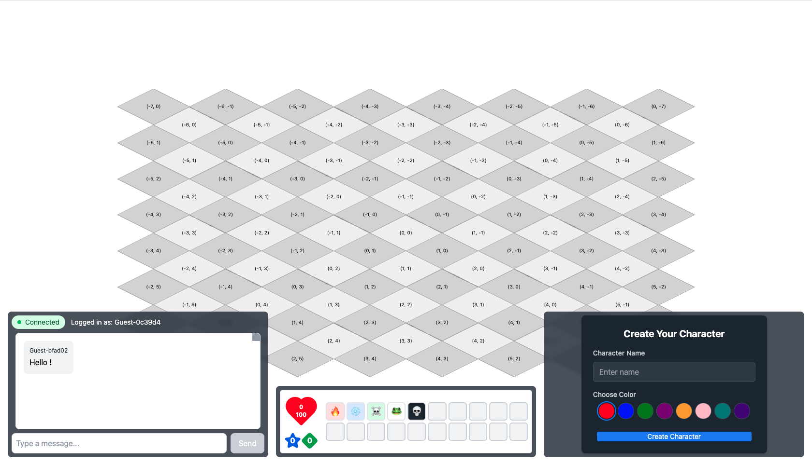

# Turn-Based Online Game (Combat System)

A turn-based online game inspired by Dofus, focusing on the combat system. This repository currently contains the foundational WebSocket implementation with a basic chat system, which will serve as the base for real-time game communications.



## Project Overview

### Current Stage: WebSocket Foundation

The current implementation focuses on establishing the WebSocket infrastructure that will be used throughout the game. A basic chat system has been implemented as a proof of concept for real-time communication between clients.

### Planned Features

- ⚔️ Turn-based combat system
- 🎮 Character movement and positioning
- 🎲 Combat mechanics and abilities
- 🌍 Battle arena implementation
- 👥 Multiplayer combat sessions

## Current Features (WebSocket Implementation)

- Real-time WebSocket communication
- Multi-client support
- Message broadcasting system
- Connection state management
- Game state management
- Isometric board rendering

## Tech Stack

- **Backend**: Go with Gorilla WebSocket
- **Frontend**: React + TypeScript
- **Styling**: Tailwind CSS
- **Build Tool**: Vite

## Getting Started

### Prerequisites

- Go 1.21+
- Node.js 18+
- npm 9+

### Running with Docker

The easiest way to get started is by using Docker:

```bash
#Build and start the application
docker-compose up --build

# Access the application at http://localhost
```

### Docker Configuration

The application is containerized using Docker:

- `Dockerfile.backend`: Go backend container
- `Dockerfile.frontend`: React frontend container with Nginx
- `nginx.conf`: Nginx configuration for serving the frontend and proxying WebSocket connections
- `docker-compose.yml`: Orchestrates the multi-container setup

### Manual Setup

#### Backend Setup

```bash
cd backend
go mod init game-server
go get github.com/gorilla/websocket
go run cmd/server/main.go
```

#### Frontend Setup

```bash
cd frontend
npm install
npm run dev
```

## Messaging Architecture

At the core of this real-time game is a robust WebSocket-based messaging system that facilitates seamless communication between the frontend clients and the Go backend server. This architecture ensures that all players receive immediate updates on game state changes, providing a dynamic and interactive experience.

### Key Principles:

-   **Centralized Game State:** The backend server is the single source of truth for the entire game state. All client actions are processed by the server, which then updates its internal game state.
-   **Event-Driven Communication:** Clients send specific action messages (events) to the server (e.g., `move`, `cast_spell`). The server processes these events and, if valid, updates the game state.
-   **Broadcast Updates:** After any significant game state change (e.g., a character moves, a spell is cast, a turn ends), the server broadcasts the updated `game_state` to all connected clients. This ensures all players have a consistent view of the game.
-   **JSON Messaging:** All messages exchanged between the frontend and backend are formatted as JSON, ensuring easy parsing and interoperability.

### Core Message Types:

1.  **`user_init` (Server to Client):** Sent by the server upon a new client connection to provide the client with their unique `userId` and `userName`.
2.  **`chat` (Client to Server & Server to Clients):** Allows players to send chat messages, which are then broadcasted to all other connected clients.
3.  **`create_character` (Client to Server):** Sent by a client to create their character, including initial attributes like name, color, and symbol.
4.  **`character_positioned` (Client to Server):** Sent by a client to confirm their chosen initial position on the game board. The backend processes this, and once all players have positioned their characters, the game transitions to the `playing` state.
5.  **`move` (Client to Server):** Sent by a client to request a character movement to a new position.
6.  **`cast_spell` (Client to Server):** Sent by a client to cast a spell, specifying the `spellId` and `targetPosition`. The backend validates AP cost, calculates affected areas, applies damage, and updates character health.
7.  **`end_turn` (Client to Server):** Sent by a client to signify the end of their turn, triggering the backend to advance the game to the next character or turn.
8.  **`game_state` (Server to Clients):** This is the most crucial message for synchronization. The server broadcasts a comprehensive snapshot of the current game state (including all players' positions, health, AP/MP, turn number, game status, and available spells) to all connected clients after any action that modifies the game state.

### Example Flow: Casting a Spell

1.  **Frontend Action:** A player clicks on a spell and then a target cell on the game board.
2.  **Client Sends `cast_spell`:** The frontend constructs a `cast_spell` message containing the `spellId`, `targetPosition`, and the `userId` of the casting player. This message is sent via WebSocket to the backend.
3.  **Backend Processing:**
    *   The backend receives the `cast_spell` message.
    *   It retrieves the casting player's current Action Points (AP) and the spell's AP cost.
    *   It validates if the player has sufficient AP. If not, the action is rejected.
    *   It calculates the cells affected by the spell's Area of Effect (AoE) based on the `targetPosition` and the caster's position (for directional spells).
    *   For each affected character, it applies the spell's damage, potentially updating their `Health` and `IsAlive` status.
    *   The casting player's AP is reduced by the spell's cost.
4.  **Backend Broadcasts `game_state`:** After successfully processing the spell cast and updating the internal game state, the backend broadcasts a new `game_state` message to all connected clients.
5.  **Frontend Updates:** All frontends receive the `game_state` message and update their local representation of the game board, reflecting changes like reduced health, character deaths, and updated AP/MP values.

## Development Roadmap

### Phase 1: Communication Infrastructure ✅

- [x] WebSocket implementation
- [x] Real-time chat system
- [x] Client connection management

### Phase 2: Game Engine ✅

- [x] Isometric Grid rendering
- [x] Game state management
- [x] Battle initialization
- [x] Turn system implementation
- [x] Character movement
- [x] Initial character positioning (hidden until all players confirm)
- [x] Spell casting with Area of Effect (AoE) and AP validation
- [x] Game Over condition detection
- [x] AP reset at turn end

### Phase 3: Combat System (Upcoming)

- [ ] Advanced combat actions (e.g., buffs, debuffs)
- [ ] Comprehensive spell system (e.g., different spell effects)
- [ ] Effect management (e.g., status effects)

### Phase 4: User Interface (Planned)

- [ ] Character animations
- [ ] Combat UI enhancements
- [ ] Ability interface improvements

## Next Steps

1. Refine spell effects and add more diverse combat mechanics.
2. Implement character animations for movement and actions.
3. Enhance the user interface for a more immersive experience.


## Development Notes

- The backend handles WebSocket connections and maintains the game state
- The frontend connects to the backend via WebSocket for real-time updates
- Nginx serves as a proxy for WebSocket connections in the Docker setup

## Acknowledgments

- Inspired by Dofus combat system
- Built with modern web technologies
- Community contributions welcome
