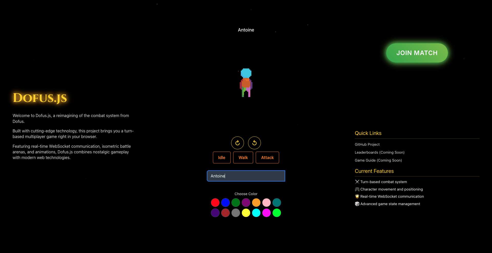
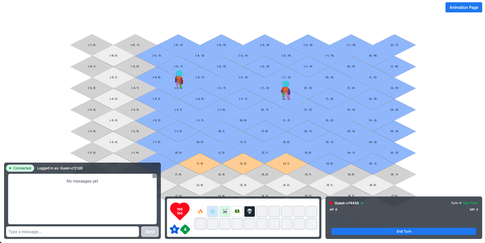
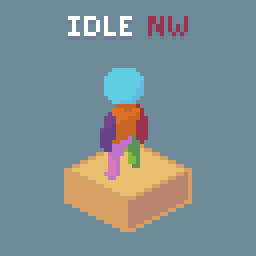
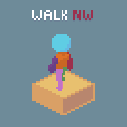
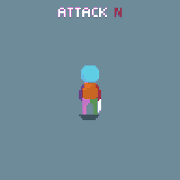

# Dofus.js: A Turn-Based Tactical battle Game

Dofus.js is a web-based, turn-based tactical  game inspired by the classic game Dofus. Built with a modern tech stack, it features a real-time combat system, character animations, and a scalable architecture.




<p float="left">
  
  
  
</p>

## ✨ Key Features

-   **Tactical Turn-Based Combat:** Engage in strategic battles on an isometric grid.
-   **Real-Time Multiplayer:** Interact with other players in real-time, thanks to a WebSocket-based architecture.
-   **Dynamic Animations:** Characters come to life with animations for idling, walking, and attacking.
-   **In-Game Chat:** Communicate with other players in the game.

## 🚀 Getting Started

### Prerequisites

-   Go 1.21+
-   Node.js 18+
-   npm 9+
-   Docker (for containerized setup)

### Running with Docker (Recommended)

The easiest way to get the game running is with Docker.

1.  **Build and start the containers:**
    ```bash
    docker-compose up --build
    ```
2.  **Access the game:**
    Open your browser and navigate to `http://localhost`.

### Manual Setup

If you prefer to run the frontend and backend services manually:

1.  **Backend Setup:**
    ```bash
    cd backend
    go mod tidy
    go run cmd/server/main.go
    ```
2.  **Frontend Setup:**
    ```bash
    cd frontend
    npm install
    npm run dev
    ```

## 🛠️ Architecture & Tech Stack

Dofus.js is built with a decoupled frontend and backend architecture, communicating via WebSockets.

-   **Backend:** Written in **Go**, using the **Gorilla WebSocket** library for real-time communication. The backend manages the game state, processes player actions, and broadcasts updates to all clients.
-   **Frontend:** A **React** application built with **Vite** and written in **TypeScript**. It uses **Tailwind CSS** for styling and renders the game on an HTML5 Canvas.
-   **Containerization:** The entire application is containerized using **Docker** and orchestrated with **Docker Compose**. **Nginx** serves the frontend and acts as a reverse proxy for the WebSocket connection.

### Real-Time Communication

The game relies on a WebSocket-based messaging system for real-time updates.

-   **Centralized State:** The Go backend is the single source of truth for the game state.
-   **Event-Driven:** The frontend sends player actions (e.g., `move`, `cast_spell`) as JSON messages to the backend.
-   **State Broadcast:** The backend processes actions, updates the game state, and broadcasts the new state to all connected clients, ensuring a consistent experience for everyone.

## 🎨 Character Animations

Character animations are handled on the frontend using sprite sheets and a custom React hook (`useCharacterAnimations`). The hook listens for changes in the game state (like movement or spell casting) and renders the appropriate animation (`Idle`, `Walk`, or `Attack`) to a `<canvas>` element.

## 🗺️ Development Roadmap

### Phase 1: Communication Infrastructure ✅

-   [x] WebSocket implementation
-   [x] Real-time chat system
-   [x] Client connection management

### Phase 2: Game Engine ✅

-   [x] Isometric Grid rendering
-   [x] Game state management
-   [x] Battle initialization
-   [x] Turn system implementation
-   [x] Character movement
-   [x] Initial character positioning
-   [x] Spell casting with Area of Effect (AoE)
-   [x] Game Over condition detection

### Phase 3: Combat System (Current)

-   [x] Character animations
-   [ ] Advanced combat actions (buffs, debuffs)
-   [ ] More spell effects
-   [ ] Status effects

### Phase 4: User Interface (Planned)

-   [ ] Combat UI enhancements
-   [ ] Improved spell/ability interface
