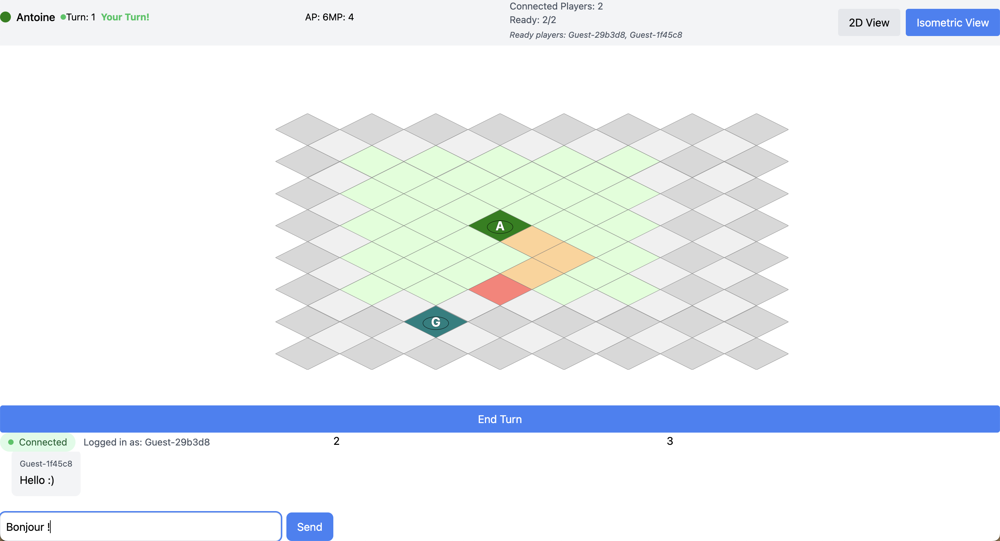

# Turn-Based Online Game (Combat System)

A turn-based online game inspired by Dofus, focusing on the combat system. This repository currently contains the foundational WebSocket implementation with a basic chat system, which will serve as the base for real-time game communications.



## Project Overview

### Current Stage: WebSocket Foundation

The current implementation focuses on establishing the WebSocket infrastructure that will be used throughout the game. A basic chat system has been implemented as a proof of concept for real-time communication between clients.

### Planned Features

- ⚔️ Turn-based combat system
- 🎮 Character movement and positioning
- 🎲 Combat mechanics and abilities
- 🌍 Battle arena implementation
- 👥 Multiplayer combat sessions

## Current Features (WebSocket Implementation)

- Real-time WebSocket communication
- Multi-client support
- Message broadcasting system
- Connection state management
- Game state management
- Isometric board rendering

## Project Structure

```mermaid
project/
├── backend/               # Go server
│   ├── cmd/
│   │   └── server/       # Server entry point
│   └── internal/
│       ├── models/       # Data structures
│       └── websocket/    # WebSocket implementation
└── frontend/             # React client
    ├── src/
    │   ├── components/   # React components
    │   ├── providers/    # Context providers
    │   └── types/       # TypeScript definitions
    └── package.json
```

## Tech Stack

- **Backend**: Go with Gorilla WebSocket
- **Frontend**: React + TypeScript
- **Styling**: Tailwind CSS
- **Build Tool**: Vite

## Getting Started

### Prerequisites

- Go 1.21+
- Node.js 18+
- npm 9+

### Backend Setup

```bash
cd backend
go mod init game-server
go get github.com/gorilla/websocket
go run cmd/server/main.go
```

### Frontend Setup

```bash
cd frontend
npm install
npm run dev
```

## Development Roadmap

### Phase 1: Communication Infrastructure ✅

- [x] WebSocket implementation
- [x] Real-time chat system
- [x] Client connection management

### Phase 2: Game Engine (Upcoming)

- [x] Game state management 
- [ ] Turn system implementation
- [ ] Combat mechanics
- [ ] Character movement

### Phase 3: Combat System (Planned)

- [ ] Battle initialization
- [ ] Combat actions
- [ ] Spell system
- [ ] Effect management

### Phase 4: User Interface (Planned)

- [x] Isometric Grid rendering
- [ ] Character animations
- [ ] Combat UI
- [ ] Ability interface

## Next Steps

1. Implement game state management
2. Add battle grid system
3. Develop basic combat mechanics
4. Create character movement system

## Development Notes

- Future updates will include game-specific message types and handlers

## Acknowledgments

- Inspired by Dofus combat system
- Built with modern web technologies
- Community contributions welcome
