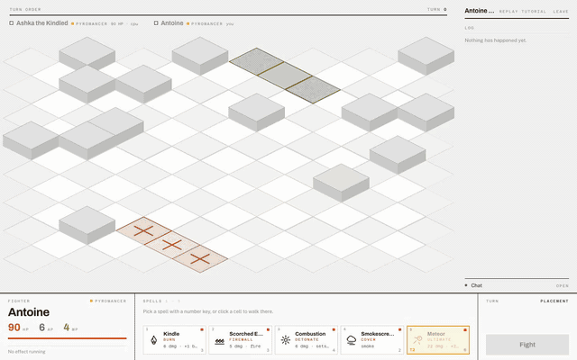
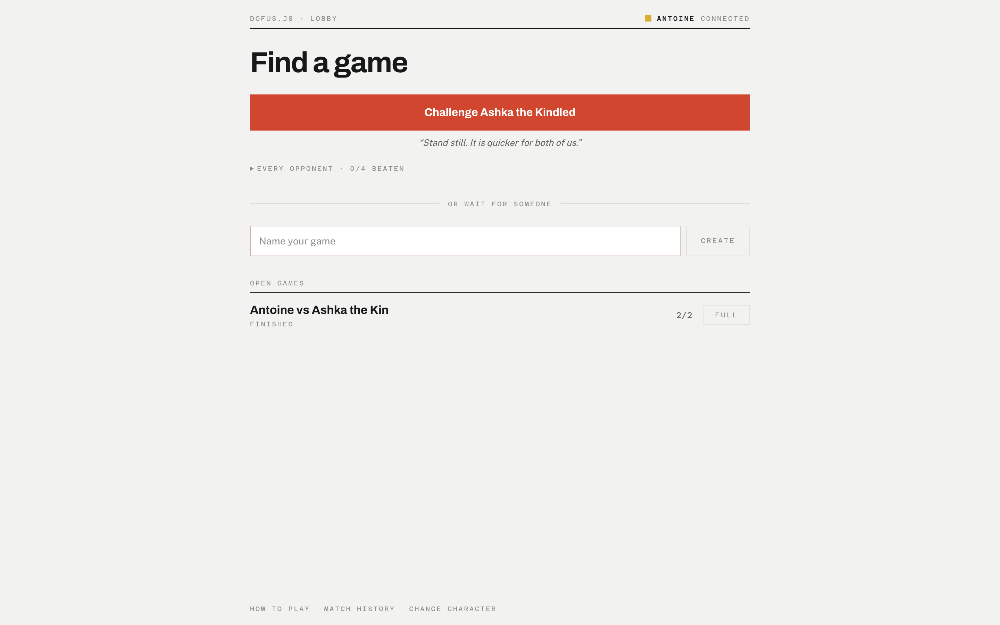
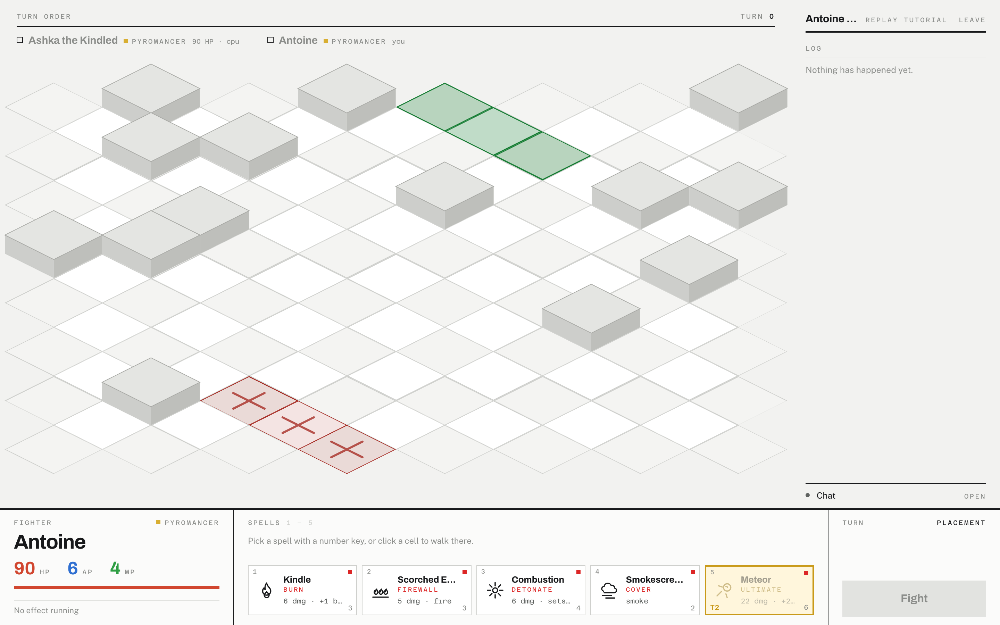

# Dofus.js

A turn-based tactical combat game in the browser, built as a study of the
combat system from Dofus. A Go server owns the rules; a React client draws an
isometric board on top of them.



<table>
<tr>
<td width="50%"></td>
<td width="50%"></td>
</tr>
</table>

## Play it

```bash
docker compose up --build
```

Then open <http://localhost>. Pick a name and a colour, and either **play
against the computer** or open a game and wait for someone to join. Two
browser tabs are enough for a real 1v1.

<details>
<summary>Without Docker</summary>

```bash
cd backend && go run ./cmd/server
```

```bash
cd frontend && npm install && npm run dev
```

The dev server proxies nothing: the client connects straight to
`ws://localhost:8080/ws`.
</details>

## How it works

The server is the referee. Every rule — whose turn it is, whether a cell is in
range, whether a spell is affordable — is decided in Go and broadcast as a
single authoritative snapshot. The client draws that snapshot and asks for
things; it is never trusted to decide anything.

```
browser ──── WebSocket ────► hub ──► room ──► game
   ▲                                            │
   └───────── game_state snapshot ──────────────┘
```

**Identity comes from the connection.** Inbound messages carry no user id at
all, so a client cannot act as another player. A resume token lets a reload or
a dropped connection come back as the same character; a player who goes away
keeps their place on the board for 45 seconds before forfeiting.

**One room, one game.** `map[roomID]*Room`, each with its own state and its own
lock. Broadcasts are scoped to a room, so two matches never see each other.

**Turns are bounded.** Each turn has a deadline; nobody can freeze a match by
walking away. The computer opponent runs on the same clock, one action per
tick, so its moves are watchable rather than instant.

**Rendering is hand-written.** No game engine: the isometric projection, the
back-to-front draw order, the screen-to-grid hit test and the sprite-sheet
animation loop are all in the client, and the geometry is unit-tested.

### Layout

```
backend/
  cmd/server/          entry point: config, HTTP, graceful shutdown
  internal/config/     environment-driven settings
  internal/game/       rules, lobby, spell catalogue, computer opponent
  internal/websocket/  hub, sessions, per-connection pumps, handlers
  internal/types/      wire format shared by every layer
frontend/src/
  pages/               landing, lobby, board
  components/Game/     board, tiles, characters, spell bar
  hooks/               animation loop, grid interaction, tile sizing
  utils/               isometric maths, pathing, spell areas
```

## Configuration

Copy `.env.example` to `.env`. Everything has a working default.

| Variable | Default | What it does |
|---|---|---|
| `HTTP_PORT` | `80` | Port the site is served on |
| `ALLOWED_ORIGINS` | `*` | Origins allowed to open a WebSocket. **Pin this for a public deployment.** |
| `TURN_SECONDS` | `45` | How long a player gets before their turn passes on |
| `STATIC_DIR` | unset | When set, the Go binary also serves the built frontend |
| `VITE_WS_URL` | unset | Build-time, client side: where the game server lives when it is not the host serving the page |

## Deploying

### Render (free)

`render.yaml` describes two free services that wire themselves together — push
the repo, point Render at the blueprint, and there is nothing to paste in.

1. New → **Blueprint**, pick this repository.
2. Apply. Render builds `dofusjs-api` from `Dockerfile.backend` and `dofusjs`
   as a static site from `frontend/`.

The client is a static site and the Go server is a web service, deliberately.
A free web service sleeps after 15 minutes and takes about a minute to wake:
serving the frontend from the Go binary would mean a visitor stares at a blank
tab for that minute. Split, the page is instant and only the WebSocket waits —
and the UI already says "Reconnecting…" and backs off while it does.

The blueprint locks `ALLOWED_ORIGINS` to the static site's hostname, so no
other origin can open a socket against the server.

Because the server keeps every game in memory, a sleep wipes the lobby. That is
the design, not a regression: rooms are transient, and a returning player just
starts a new one.

### Anywhere else

The root `Dockerfile` builds a single ~25 MB image where the Go binary serves
both the API and the built frontend, so any container host will do.

```bash
docker build -t dofusjs .
docker run -p 8080:8080 -e ALLOWED_ORIGINS=https://your.domain dofusjs
```

`fly.toml` is ready for [fly.io](https://fly.io), which suspends rather than
stops and so wakes faster:

```bash
fly launch --no-deploy   # once, to claim the app name
fly deploy
fly secrets set ALLOWED_ORIGINS=https://your-app.fly.dev
```

`docker-compose.yml` keeps the nginx + backend split instead, which is closer
to a classic production layout and is what local development uses.

## Tests

```bash
cd backend && go test -race ./...     # rules, lobby, turn cycle, bot
cd frontend && npm test               # isometric geometry
cd frontend && npm run lint && npm run build
```

CI runs all of it on every push, plus `gofmt`, `go vet` and a full
`docker compose build`.

## Status

Playable end to end: lobby, placement, movement, spells with areas of effect,
a computer opponent, rematches and reconnection. What is not there yet:

- **Line of sight.** `needsLineOfSight` is carried in the spell catalogue and
  nothing enforces it.
- **Cooldowns and casts per turn.** Same: declared, not applied.
- **Status effects and critical hits.** The data model has room for them.
- **Touch support.** The board is driven by pointer hover; phones get an
  honest notice instead of a broken board.
- **Obstacles.** The map is open ground, and pathing is a two-segment L rather
  than A*.

## Licence

MIT — see [LICENSE](LICENSE).
