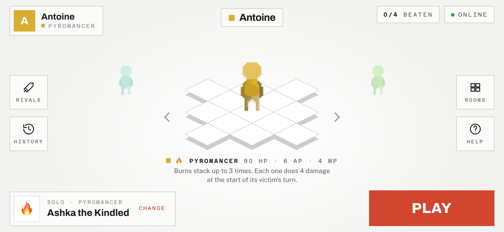
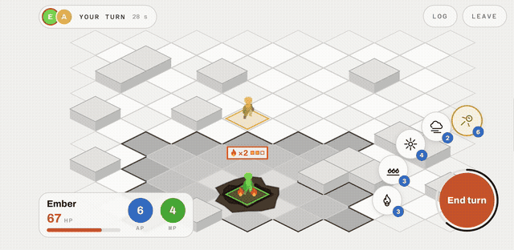

# Dofus.js

A turn-based tactical combat game in the browser, built as a study of the
combat system from Dofus. A Go server owns the rules; a React client draws an
isometric board on top of them.

### ▶ [Play it here](https://dofusjs.onrender.com)

No account, no install. Pick a name and a class, challenge the computer, and you
have a whole match to yourself. The server sleeps after 15 minutes on the free
tier, so the first connection can take a minute to come back — the board loads
instantly either way.


<p align="center"><sub>One turn of a fight against the computer: a starting cell
picked out of the green block, a wall of fire laid across the board, and the bot
answering with a Meteor that leaves a crater behind.</sub></p>

**In the browser.** Four screens, in the order you meet them.

<table>
<tr>
<td width="50%"><br><sub><b>1 · Landing.</b> A name, a colour and one of four classes. The class's passive and its five spells read underneath, so the choice is made on what it does.</sub></td>
<td width="50%"><br><sub><b>2 · Lobby.</b> Challenge the opponent that belongs to your class, join a game someone has opened, or open one and wait.</sub></td>
</tr>
<tr>
<td width="50%"><br><sub><b>3 · Placement.</b> Each side starts in its own block — yours in green, the opponent's marked off in red — and the fight begins once both have chosen.</sub></td>
<td width="50%"><br><sub><b>4 · Combat.</b> What spells leave behind stays: a wall of fire, a crater, burn counters over both fighters. The bar names what each spell is for.</sub></td>
</tr>
</table>

**On a phone.** The same game, laid out for two thumbs.

<table>
<tr>
<td width="50%"><br><sub><b>Home.</b> Your fighter on a stand with the other classes waiting faded on either side, and one Play button under the right thumb.</sub></td>
<td width="50%"><br><sub><b>Combat.</b> The board takes the whole screen, the controls float over its corners, and the spells sit in an arc where the thumb already is.</sub></td>
</tr>
</table>



<p align="center"><sub>The same fight in the iOS app, held sideways: the board
keeps the screen to itself and every control sits within reach of a thumb.</sub></p>

On a phone, hold it sideways. The lobby becomes a home screen: your fighter in
the middle, arrows (or a swipe) to slide through the classes with the others
waiting faded on either side, a tap on your name to rename, and one big Play
button under the right thumb. In a fight the board takes the whole screen and
the controls float over its corners — turn order top left, your HP, AP and MP
bottom left, and your spells in an arc around the End turn button bottom
right, all five of them on one ring.

There is no hovering on a touch screen, so a tap previews a cell — its walk,
its area of effect, who it would hit and what they would be left with — and a
bubble beside it confirms (*Move · 3 MP*, *Cast −7*). Holding a spell opens a
card that plays the spell out on a few cells: its range, the shot, the area
it lands on, the damage. Held upright, in a browser, the spells get a row of
their own under the board instead.

## Run it yourself

```bash
docker compose up --build
```

Then open <http://localhost>. Pick a name, a colour and a class, and either
**challenge the computer** or open a game and wait for someone to join. Two
browser tabs are enough for a real 1v1.

There are four classes, one per element: the **Pyromancer** (burns that stack
and then go off at once), the **Windwalker** (reach, through a relay it sets
across the board, and displacement), the **Tidecaller** (control: traps, ice
and water) and the **Stonewarden** (a brawler that leaps into reach and walls
off the way out). Each carries five spells of its own element, every one with
its own job, and one **ultimate** — cast once a fight, from turn 2. In solo
play each class is a named opponent, and beating one unlocks the next.

Spells change the board and what they leave stays for the rest of the fight:
fire that burns whoever walks in, smoke nothing is seen through, water that
slows enemies and puts fire out, ice you slide across, bubble traps, pillars,
craters and fissures nobody walks through. Hover a changed cell to read what
it does.

Number keys `1`–`5` pick a spell, `Escape` drops the selection, and on a touch
screen a first tap previews a cell while a second one acts on it. Cover blocks
both movement and line of sight; smoke blocks sight alone.

<details>
<summary>Without Docker</summary>

```bash
cd backend && go run ./cmd/server
```

```bash
cd frontend && npm install && npm run dev
```

The dev server proxies nothing: the client connects straight to
`ws://localhost:8080/ws`.
</details>

## How it works

The server is the referee. Every rule — whose turn it is, whether a cell is in
range, whether a spell is affordable — is decided in Go and broadcast as a
single authoritative snapshot. The client draws that snapshot and asks for
things; it is never trusted to decide anything.

```
browser ──── WebSocket ────► hub ──► room ──► game
   ▲                                            │
   └───────── game_state snapshot ──────────────┘
```

**Identity comes from the connection.** Inbound messages carry no user id at
all, so a client cannot act as another player. A resume token lets a reload or
a dropped connection come back as the same character; a player who goes away
keeps their place on the board for 45 seconds before forfeiting.

**One room, one game.** `map[roomID]*Room`, each with its own state and its own
lock. Broadcasts are scoped to a room, so two matches never see each other.

**Turns are bounded.** Each turn has a deadline; nobody can freeze a match by
walking away. The computer opponent runs on the same clock, one action per
tick, so its moves are watchable rather than instant.

**Content is data, and data is checked.** Spells and classes live in
`backend/config/spells.json` and `classes.json`, not in Go. They are validated
once at startup — unknown fields, unknown spell ids, AP costs a class cannot
pay, ranges off the board, criticals weaker than the hit — and a bad file
stops the server with the file, the field and the problem, instead of shipping
a fight that breaks on the first cast. Adding a class is a `classes.json` edit.
Balance is a test rather than an opinion: every class is played against every
class by the server's own bot over seeded matches, and CI fails if any class
wins more than 65% of a matchup or fights stop lasting four to eight turns. The
shipped kits sit between 40% and 60%, over fights of five turns.

**Rendering is hand-written.** No game engine: the isometric projection, the
back-to-front draw order, the screen-to-grid hit test and the sprite-sheet
animation loop are all in the client, and the geometry is unit-tested.

**One board, two layouts.** On a wide screen the board is never covered: the
log sits beside it, and the bar under it folds from three roomy zones to three
tight ones as the width shrinks. A phone held sideways — the shape the board
actually wants — gets its own layout instead, chosen by viewport height: the
board fills the screen, the HUD floats over the diamond's empty corners, and
every action sits under a thumb.

**The screen has one rule.** Paper, ink, graphite and a single vermilion: three
weights of rule and the size of the figures do the separating, and the only
saturated colour marks *what the click is about to do* — the walk to the cell
under the cursor, or the cells a spell would hit. Where you may act is a
graphite wash with a drawn boundary, and that boundary is the information: it
bends around cover, so its shape is the line of sight. Every colour comes from
`frontend/tailwind.config.js` and `frontend/src/constants.ts`; changing the
look is a change to those two files.

### Layout

```
backend/
  cmd/server/          entry point: config, HTTP, graceful shutdown
  internal/config/     environment-driven settings
  config/              balance.json, spells.json, classes.json — the game's numbers
  internal/content/    loads and validates spells and classes
  internal/game/       rules, lobby, computer opponent, balance simulation
  internal/websocket/  hub, sessions, per-connection pumps, handlers
  internal/types/      wire format shared by every layer
frontend/src/
  pages/               landing, lobby, board
  components/Game/     board, tiles, characters, spell bar, turn order, log,
                       the phone HUD (spell arc, fighter status) and spell cards
  components/Lobby/    the phone home screen: class line-up, rename dialog
  components/Chat/     the rail's chat section
  hooks/               animation loop, grid interaction, tile sizing
  lib/native.ts        what the iOS app does that a browser cannot (haptics)
  utils/               isometric maths, pathing, spell areas
  constants.ts         board palette and stroke widths
  tailwind.config.js   the screen's colours and three typefaces
frontend/ios/          the Capacitor Xcode project for the iOS app
```

## Configuration

Copy `.env.example` to `.env`. Everything has a working default.

| Variable | Default | What it does |
|---|---|---|
| `HTTP_PORT` | `80` | Port the site is served on |
| `ALLOWED_ORIGINS` | `*` | Origins allowed to open a WebSocket, comma separated. **Pin this for a public deployment.** An entry naming a scheme (`https://example.com`, `capacitor://localhost`) matches that origin exactly; a bare hostname (`example.com`) matches the host whatever the scheme. |
| `TURN_SECONDS` | `45` | How long a player gets before their turn passes on |
| `STATIC_DIR` | unset | When set, the Go binary also serves the built frontend |
| `BALANCE_FILE` | `config/balance.json` | Default health, action points and movement points, for every class that does not set its own. Edit `backend/config/balance.json` to retune every fight at once. A missing file falls back to built-in defaults. |
| `SPELLS_FILE` | `config/spells.json` | Every spell, keyed by id, and one colour per element. Beyond cost, range, damage and area, a spell says what it is for (`role`), whether it is an `ultimate`, what it may be aimed at (`targeting`), how far it pushes or pulls (`push`), what `terrain` or `zone` it leaves, and which `special` it runs. Validated at startup: the server refuses to start on a bad file. |
| `CLASSES_FILE` | `config/classes.json` | Every class, in picker order: name, element, symbol, palette, lore, the passive line the picker shows, optional health/AP/MP overrides, the melee bonus and push resistance it fights with, its spell bar (1 to 8 ids; the shipped classes carry five), the named solo opponent with its two lines, and which class unlocks it. Validated at startup like `SPELLS_FILE`. |
| `LOG_FORMAT` | `json` | Server log format: `json` for an aggregator, `text` for a terminal |
| `LOG_LEVEL` | `info` | Minimum log level: `debug`, `info`, `warn` or `error` |
| `METRICS_ADDR` | `127.0.0.1:9090` | Listen address for `/metrics` (Prometheus), served on its own loopback-only listener — see [Performance](#performance). Empty disables it. |
| `VITE_WS_URL` | unset | Build-time, client side: where the game server lives when it is not the host serving the page |

## Deploying

### Render (free)

`render.yaml` describes two free services: `dofusjs-api` from
`Dockerfile.backend`, and `dofusjs` as a static site from `frontend/`.

1. New → **Blueprint**, pick this repository.
2. Render asks for two values. They point the services at each other, and they
   have to be filled in by hand — a blueprint's `fromService` only exposes a
   service's *private network* hostname, which a browser cannot resolve.

   | Service | Variable | Value |
   |---|---|---|
   | `dofusjs` | `VITE_WS_URL` | `wss://dofusjs-api.onrender.com/ws` |
   | `dofusjs-api` | `ALLOWED_ORIGINS` | `https://dofusjs.onrender.com,capacitor://localhost` |

   This is exactly how <https://dofusjs.onrender.com> is deployed.

   Substitute your own service names if you renamed them. `VITE_WS_URL` is
   baked into the bundle at build time, so changing it later means a rebuild,
   not just a restart.

The client is a static site and the Go server is a web service, deliberately.
A free web service sleeps after 15 minutes and takes about a minute to wake:
serving the frontend from the Go binary would mean a visitor stares at a blank
tab for that minute. Split, the page is instant and only the WebSocket waits —
and the UI already says "Reconnecting…" and backs off while it does.

The blueprint locks `ALLOWED_ORIGINS` to the static site's origin and the iOS
app's, so no other origin can open a socket against the server. Leave the
second one out and the phone gets a 403 at the handshake, with nothing but
"Reconnecting…" to explain it.

Because the server keeps every game in memory, a sleep wipes the lobby. That is
the design, not a regression: rooms are transient, and a returning player just
starts a new one.

### Anywhere else

The root `Dockerfile` builds a single ~25 MB image where the Go binary serves
both the API and the built frontend, so any container host will do.

```bash
docker build -t dofusjs .
docker run -p 8080:8080 -e ALLOWED_ORIGINS=https://your.domain dofusjs
```

`fly.toml` is ready for [fly.io](https://fly.io), which suspends rather than
stops and so wakes faster:

```bash
fly launch --no-deploy   # once, to claim the app name
fly deploy
fly secrets set ALLOWED_ORIGINS=https://your-app.fly.dev
```

`docker-compose.yml` keeps the nginx + backend split instead, which is closer
to a classic production layout and is what local development uses.

## iOS app

The same client ships as a native iOS app through
[Capacitor](https://capacitorjs.com): Vite builds the page, and the Xcode
project in `frontend/ios` serves it from the app bundle. Only the game server
is remote. On the device the app buzzes when your turn comes round and when a
fight ends; in a browser those calls do nothing.

It needs a full Xcode (not only the command-line tools), Node 22+ for the
Capacitor CLI, and, once:

```bash
sudo xcode-select -s /Applications/Xcode.app/Contents/Developer
sudo xcodebuild -license accept
```

**Day to day: live reload.** Run the backend as usual and point the app at the
Vite dev server; edits then show up without rebuilding. In the simulator
`localhost` is the Mac. A phone needs the Mac's LAN address — and Vite binds to
localhost unless told otherwise, so it has to be started with `--host` or the
phone will not reach it at all.

```bash
cd frontend && npm run dev -- --host
```

```bash
cd frontend && npm run build && CAP_SERVER_URL=http://localhost:5173 npm run ios:dev
```

```bash
cd frontend && npm run build && CAP_SERVER_URL=http://192.168.1.20:5173 npm run ios:dev
```

**On a real phone, the first time.** Connect it by USB, unlock it, and accept
"Trust This Computer" — the prompt only appears on an unlocked screen. From
iOS 16 the phone also needs Settings → Privacy & Security → Developer Mode,
which shows up in that menu only after a Mac has tried to install something on
it. Signing needs a team set in Xcode under Signing & Capabilities, and the
first launch is refused until the certificate is approved on the phone, under
Settings → General → VPN & Device Management.

**`cap run ios` only lists devices on USB.** It enumerates through `xctrace`,
which calls a phone connected over Wi-Fi offline however well it answers
otherwise. Such a phone shows as `connected` to the modern tool and never
appears in Capacitor's menu, which offers simulators only and looks as though
the device were missing. Run it from Xcode instead — Xcode uses CoreDevice and
sees it — or plug the cable in.

```bash
xcrun devicectl list devices | grep physical
```

**Xcode does not sync.** Copying `dist/` into `ios/App/App/public`, and
writing `ios/App/App/capacitor.config.json` from `capacitor.config.ts` and
`CAP_SERVER_URL`, is what `cap sync` does — `cap run` does it on the way past.
Pressing Run in Xcode ships whatever is already on disk. So after switching
between live reload and a bundled build, sync first, or the app silently keeps
the previous arrangement.

```bash
cd frontend && CAP_SERVER_URL=http://192.168.1.20:5173 npx cap sync ios
```

```bash
cd frontend && npx cap sync ios
```

**When the landing page has no classes.** The classes and spells are fetched
from the server, not shipped in the page, so a class picker that is missing
while the name and the colours are there means that request failed — and the
WebSocket is about to fail the same way. The usual cause is an app running the
bundled `dist` with no `VITE_WS_URL` baked in: its origin is then
`capacitor://localhost`, and the API address derived from it goes nowhere.
Check which arrangement the app actually has.

```bash
cat frontend/ios/App/App/capacitor.config.json
```

A `server.url` means live reload; no `server` block means the bundle.

**Checking how it feels.** Live reload runs React's development build, which
is several times slower; judge smoothness on a production build instead,
served from the Mac and rebuilt after each change:

```bash
cd frontend && VITE_WS_URL=ws://192.168.1.20:8080 npm run build && npx vite preview --host --port 4173
```

```bash
cd frontend && CAP_SERVER_URL=http://192.168.1.20:4173 npm run ios:dev
```

The app is locked to landscape; the portrait layout is for the browser.

**A bundled build.** The page inside the app has no server behind it, so
`ios:sync` refuses to run without `VITE_WS_URL`. Bake the address in, and let
the app's origin through on the server:

```bash
cd frontend && VITE_WS_URL=wss://dofusjs-api.onrender.com/ws npm run ios:sync && npm run ios:open
```

That is the API service, not the site. `dofusjs.onrender.com` is the static
site: it answers `/ws` with `index.html` and never upgrades, so a bundle built
against it opens on a lobby that cannot connect.

```bash
ALLOWED_ORIGINS=https://dofusjs.onrender.com,capacitor://localhost
```

The app's page comes from the bundle, so its origin is `capacitor://localhost`
— that is what the handshake carries, and it has to be on the list by name.
The scheme is part of the match: listing it does not also admit
`http://localhost`, which is any page an attacker serves from the machine.

**On your own iPhone, for free.** A free Apple ID is enough: add it under
Xcode → Settings → Accounts, plug the phone in, turn on *Settings → Privacy &
Security → Developer Mode*, pick your *Personal Team* under *Signing &
Capabilities* and press Run. The first launch asks you to trust your developer
profile under *Settings → General → VPN & Device Management*. A free install
stops opening after seven days; running it again from Xcode renews it. The
live-reload and preview builds above bake in the Mac's LAN address, so a new
address means a new install.

**TestFlight and the App Store.** TestFlight and
the store need the paid Apple Developer Program: register the bundle id from
`frontend/capacitor.config.ts` (`com.antoineroyerb.dofusjs`), pick the team
under *Signing & Capabilities*, then *Product → Archive → Distribute App*.
Google Sign-In does not work inside the app: Google refuses OAuth in embedded
web views, so the app plays anonymously.

## Tests

```bash
cd backend && go test -race ./...     # rules, lobby, turn cycle, bot, content, balance
cd frontend && npm test               # isometric geometry, spell text, terrain, solo arc, phone HUD
cd frontend && npm test -- --coverage # the same, failing if the phone HUD's logic loses coverage
cd frontend && npm run lint && npm run build
```

The README's screenshots and GIFs are shot by a script, against a real server,
so they cannot drift from the game: see `frontend/scripts/shoot-readme.mjs`
for the two commands.

The phone layout's decisions — the spell arc's slots and folding, the class
line-up, what the confirm bubble offers and where it opens, the board's tile
fit, the native helpers — live in plain modules, so they are tested without
a DOM.

CI runs all of it on every push, plus `gofmt`, `go vet`, a full
`docker compose build`, and, on macOS, the iOS app: the web bundle synced into
the Xcode project and compiled for the simulator, unsigned.

## Performance

The server logs structured JSON (`LOG_FORMAT`/`LOG_LEVEL`, see
[Configuration](#configuration)) — every line inside a match carries
`match_id`, and every line inside a connection carries `user_id`, so one fight
can be `grep`'d out of the stream. It also exposes Prometheus metrics
(connections, rooms by status, command counts and latency, rejections, turn
timeouts, bot decision time, broadcast fan-out time, dropped sends,
reconnects — see `backend/internal/metrics/metrics.go`) at `/metrics`, on its
**own listener bound to `127.0.0.1:9090` by default**, separate from the
public port — set `METRICS_ADDR` to widen that deliberately (e.g. for a
Prometheus scraper on the same host or network). A starter
[Grafana dashboard](docs/grafana-dashboard.json) covers all of them.

`backend/cmd/loadtest` opens real WebSocket clients, pairs them two per room,
and plays each pair through a full match using the same decision logic as the
server's own bot opponent — so it exercises real command handling, not just
open sockets:

```bash
cd backend
go run ./cmd/server                    # one terminal
go run ./cmd/loadtest -clients=500     # another
```

Measured on 2026-09-07, on a laptop-class machine (Apple M5 Pro, 15 cores,
24 GB RAM, macOS, Go 1.27.1, in-memory match store — not the production
Render/Fly instance):

| Clients | Concurrent matches | Result | Command latency (p50 / p95 / p99) |
|---|---|---|---|
| 500 | 250 | 250/250 finished, 127 matches/sec | 391µs / 1.18ms / 1.73ms |

This is a local dev-machine number, not a production benchmark — reproduce it
yourself with the command above and your own hardware. Pushing further, to
2000 clients (1000 concurrent matches), surfaced a real bottleneck rather than
a clean number: about 6% of room joins never completed and p99 latency rose to
~50ms even with a fixed, realistic connection ramp rate (ruling out the load
test itself as the cause). That is being tracked as a follow-up rather than
papered over here — the `Hub` in `internal/websocket/hub.go` runs as a single
goroutine, and its lobby broadcast rescans every connected client on every
room event, which is a plausible culprit at that scale.

## Status

Playable end to end: lobby, placement, movement around cover with A*, spells
with areas of effect and line of sight, cooldowns, critical hits, status
effects (poison, shield, regeneration, action and movement points), a combat
log, a computer opponent, rematches and reconnection. What is not there yet:

- **More than one arena.** Cover is generated per match, but the board is
  always the same 15 × 15 diamond.
- **Anything that outlives a match.** No accounts, no ranking, no history: the
  server keeps rooms in memory and forgets them.

## Licence

MIT — see [LICENSE](LICENSE).
