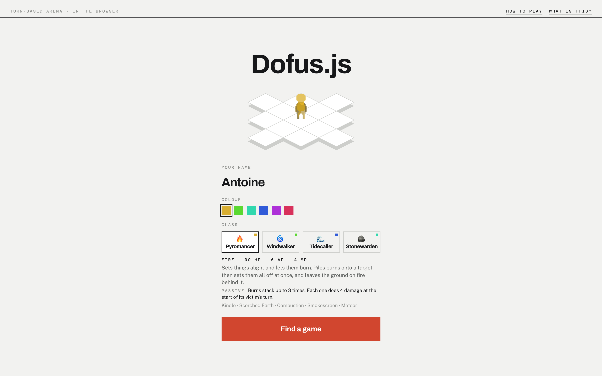
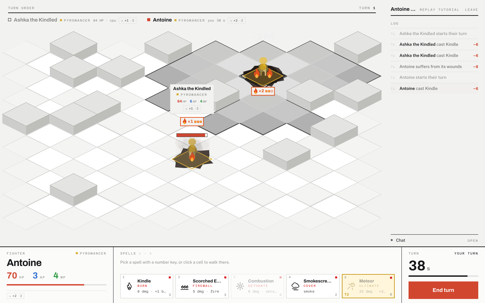
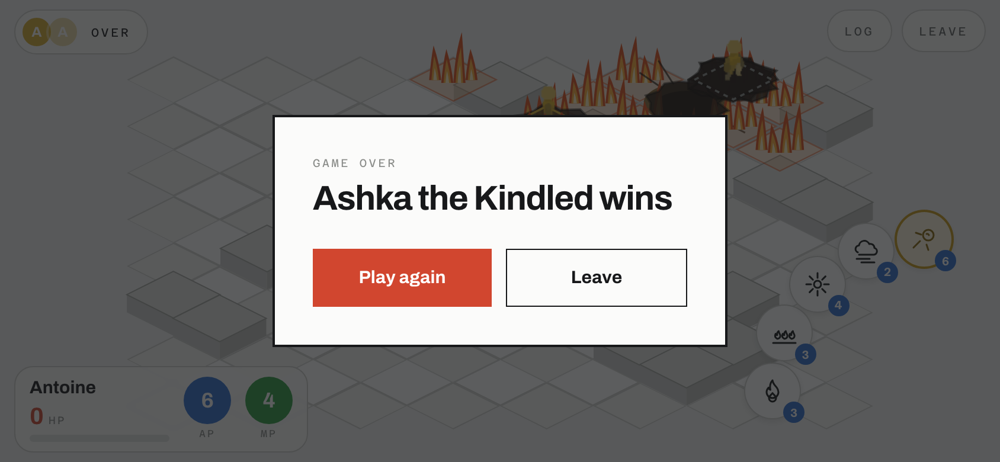

# Dofus.js

A turn-based tactical combat game in the browser, built as a study of the
combat system from Dofus. A Go server owns the rules; a React client draws an
isometric board on top of them.

### ▶ [Play it here](https://dofusjs.onrender.com)

No account, no install. Pick a name, hit **Play against the computer**, and you
have a whole match to yourself. The server sleeps after 15 minutes on the free
tier, so the first connection can take a minute to come back — the board loads
instantly either way.


<table>
<tr>
<td width="50%"></td>
<td width="50%"></td>
</tr>
<tr>
<td width="50%"></td>
<td width="50%"></td>
</tr>
</table>



On a phone, hold it sideways: the board is twice as wide as it is tall, and the
bar folds down to the figures, the spells and the button. There is no hovering
on a touch screen, so a tap previews a cell — its walk, its area of effect, the
damage it would do — and a second tap on the same cell commits it.

## Run it yourself

```bash
docker compose up --build
```

Then open <http://localhost>. Pick a name and a colour, and either **play
against the computer** or open a game and wait for someone to join. Two
browser tabs are enough for a real 1v1.

Number keys `1`–`8` pick a spell, `Escape` drops the selection, and on a touch
screen a first tap previews a cell while a second one acts on it. Cover blocks
both movement and line of sight; `Gwendo na Gwendo` is the one spell that
reaches through it.

<details>
<summary>Without Docker</summary>

```bash
cd backend && go run ./cmd/server
```

```bash
cd frontend && npm install && npm run dev
```

The dev server proxies nothing: the client connects straight to
`ws://localhost:8080/ws`.
</details>

## How it works

The server is the referee. Every rule — whose turn it is, whether a cell is in
range, whether a spell is affordable — is decided in Go and broadcast as a
single authoritative snapshot. The client draws that snapshot and asks for
things; it is never trusted to decide anything.

```
browser ──── WebSocket ────► hub ──► room ──► game
   ▲                                            │
   └───────── game_state snapshot ──────────────┘
```

**Identity comes from the connection.** Inbound messages carry no user id at
all, so a client cannot act as another player. A resume token lets a reload or
a dropped connection come back as the same character; a player who goes away
keeps their place on the board for 45 seconds before forfeiting.

**One room, one game.** `map[roomID]*Room`, each with its own state and its own
lock. Broadcasts are scoped to a room, so two matches never see each other.

**Turns are bounded.** Each turn has a deadline; nobody can freeze a match by
walking away. The computer opponent runs on the same clock, one action per
tick, so its moves are watchable rather than instant.

**Rendering is hand-written.** No game engine: the isometric projection, the
back-to-front draw order, the screen-to-grid hit test and the sprite-sheet
animation loop are all in the client, and the geometry is unit-tested.

**One layout, three shapes.** The board keeps the screen and is never covered:
the log sits beside it on a wide screen, behind a button on a narrow one, and
the bar folds from three roomy zones to three tight ones. A phone held sideways
is the shape the board actually wants, so the HUD has a compact form for short
viewports rather than a separate mobile design.

**The screen has one rule.** Paper, ink, graphite and a single vermilion: three
weights of rule and the size of the figures do the separating, and the only
saturated colour marks *what the click is about to do* — the walk to the cell
under the cursor, or the cells a spell would hit. Where you may act is a
graphite wash with a drawn boundary, and that boundary is the information: it
bends around cover, so its shape is the line of sight. Every colour comes from
`frontend/tailwind.config.js` and `frontend/src/constants.ts`; changing the
look is a change to those two files.

### Layout

```
backend/
  cmd/server/          entry point: config, HTTP, graceful shutdown
  internal/config/     environment-driven settings
  internal/game/       rules, lobby, spell catalogue, computer opponent
  internal/websocket/  hub, sessions, per-connection pumps, handlers
  internal/types/      wire format shared by every layer
frontend/src/
  pages/               landing, lobby, board
  components/Game/     board, tiles, characters, spell bar, turn order, log
  components/Chat/     the rail's chat section
  hooks/               animation loop, grid interaction, tile sizing
  utils/               isometric maths, pathing, spell areas
  constants.ts         board palette and stroke widths
  tailwind.config.js   the screen's colours and three typefaces
```

## Configuration

Copy `.env.example` to `.env`. Everything has a working default.

| Variable | Default | What it does |
|---|---|---|
| `HTTP_PORT` | `80` | Port the site is served on |
| `ALLOWED_ORIGINS` | `*` | Origins allowed to open a WebSocket. **Pin this for a public deployment.** |
| `TURN_SECONDS` | `45` | How long a player gets before their turn passes on |
| `STATIC_DIR` | unset | When set, the Go binary also serves the built frontend |
| `BALANCE_FILE` | `config/balance.json` | JSON file with gameplay constants (health, action points, movement points). Edit `backend/config/balance.json` to retune a fight without touching code. |
| `LOG_FORMAT` | `json` | Server log format: `json` for an aggregator, `text` for a terminal |
| `LOG_LEVEL` | `info` | Minimum log level: `debug`, `info`, `warn` or `error` |
| `METRICS_ADDR` | `127.0.0.1:9090` | Listen address for `/metrics` (Prometheus), served on its own loopback-only listener — see [Performance](#performance). Empty disables it. |
| `GOOGLE_CLIENT_ID` | unset | Google OAuth2 client ID. Both this and `GOOGLE_CLIENT_SECRET` must be set for Google Sign-In to turn on at all — unset (the default), `/auth/*` isn't even registered and anonymous play is all there is. |
| `GOOGLE_CLIENT_SECRET` | unset | Google OAuth2 client secret. Keep it out of the client bundle and out of version control. |
| `GOOGLE_REDIRECT_URL` | unset | The callback URL, e.g. `https://dofusjs-api.onrender.com/auth/google/callback`. Must exactly match an authorized redirect URI in the Google Cloud Console OAuth client, or Google rejects the request before it reaches this server. |
| `SESSION_COOKIE_SECRET` | random per boot | Signs the session cookie. A random one is generated (and logged as a warning) if unset — fine for a single instance, but it won't survive a restart or work across replicas, so set it explicitly for any real deployment. |
| `FRONTEND_URL` | unset | Where a completed Google sign-in redirects back to. Unset means same-origin (`/profile`), right for the single-binary deployment; the split Render deployment needs it set to the static site's URL. |
| `VITE_WS_URL` | unset | Build-time, client side: where the game server lives when it is not the host serving the page |

## Deploying

### Render (free)

`render.yaml` describes two free services: `dofusjs-api` from
`Dockerfile.backend`, and `dofusjs` as a static site from `frontend/`.

1. New → **Blueprint**, pick this repository.
2. Render asks for two values. They point the services at each other, and they
   have to be filled in by hand — a blueprint's `fromService` only exposes a
   service's *private network* hostname, which a browser cannot resolve.

   | Service | Variable | Value |
   |---|---|---|
   | `dofusjs` | `VITE_WS_URL` | `wss://dofusjs-api.onrender.com/ws` |
   | `dofusjs-api` | `ALLOWED_ORIGINS` | `https://dofusjs.onrender.com` |

   This is exactly how <https://dofusjs.onrender.com> is deployed.

   Substitute your own service names if you renamed them. `VITE_WS_URL` is
   baked into the bundle at build time, so changing it later means a rebuild,
   not just a restart.

The client is a static site and the Go server is a web service, deliberately.
A free web service sleeps after 15 minutes and takes about a minute to wake:
serving the frontend from the Go binary would mean a visitor stares at a blank
tab for that minute. Split, the page is instant and only the WebSocket waits —
and the UI already says "Reconnecting…" and backs off while it does.

The blueprint locks `ALLOWED_ORIGINS` to the static site's hostname, so no
other origin can open a socket against the server.

Because the server keeps every game in memory, a sleep wipes the lobby. That is
the design, not a regression: rooms are transient, and a returning player just
starts a new one.

Turning on Google Sign-In (`GOOGLE_CLIENT_ID`/`GOOGLE_CLIENT_SECRET` on
`dofusjs-api`) needs three things set deliberately, because the two services
sit on different `onrender.com` subdomains — different *sites*, for cookie
purposes, not just different origins:

- `GOOGLE_REDIRECT_URL` must match, character for character, an authorized
  redirect URI on the Google Cloud Console OAuth client.
- The session cookie is set `SameSite=None; Secure`, which is what a
  cross-site cookie requires — there is no same-site option that works here.
- `ALLOWED_ORIGINS` must be the static site's exact origin, never `*`: a
  cookie-carrying request needs `Access-Control-Allow-Credentials`, which
  browsers refuse to honor together with a wildcard origin.

### Anywhere else

The root `Dockerfile` builds a single ~25 MB image where the Go binary serves
both the API and the built frontend, so any container host will do.

```bash
docker build -t dofusjs .
docker run -p 8080:8080 -e ALLOWED_ORIGINS=https://your.domain dofusjs
```

`fly.toml` is ready for [fly.io](https://fly.io), which suspends rather than
stops and so wakes faster:

```bash
fly launch --no-deploy   # once, to claim the app name
fly deploy
fly secrets set ALLOWED_ORIGINS=https://your-app.fly.dev
```

`docker-compose.yml` keeps the nginx + backend split instead, which is closer
to a classic production layout and is what local development uses.

## Tests

```bash
cd backend && go test -race ./...     # rules, lobby, turn cycle, bot
cd frontend && npm test               # isometric geometry
cd frontend && npm run lint && npm run build
```

CI runs all of it on every push, plus `gofmt`, `go vet` and a full
`docker compose build`.

## Performance

The server logs structured JSON (`LOG_FORMAT`/`LOG_LEVEL`, see
[Configuration](#configuration)) — every line inside a match carries
`match_id`, and every line inside a connection carries `user_id`, so one fight
can be `grep`'d out of the stream. It also exposes Prometheus metrics
(connections, rooms by status, command counts and latency, rejections, turn
timeouts, bot decision time, broadcast fan-out time, dropped sends,
reconnects — see `backend/internal/metrics/metrics.go`) at `/metrics`, on its
**own listener bound to `127.0.0.1:9090` by default**, separate from the
public port — set `METRICS_ADDR` to widen that deliberately (e.g. for a
Prometheus scraper on the same host or network). A starter
[Grafana dashboard](docs/grafana-dashboard.json) covers all of them.

`backend/cmd/loadtest` opens real WebSocket clients, pairs them two per room,
and plays each pair through a full match using the same decision logic as the
server's own bot opponent — so it exercises real command handling, not just
open sockets:

```bash
cd backend
go run ./cmd/server                    # one terminal
go run ./cmd/loadtest -clients=500     # another
```

Measured on 2026-09-07, on a laptop-class machine (Apple M5 Pro, 15 cores,
24 GB RAM, macOS, Go 1.27.1, in-memory match store — not the production
Render/Fly instance):

| Clients | Concurrent matches | Result | Command latency (p50 / p95 / p99) |
|---|---|---|---|
| 500 | 250 | 250/250 finished, 127 matches/sec | 391µs / 1.18ms / 1.73ms |

This is a local dev-machine number, not a production benchmark — reproduce it
yourself with the command above and your own hardware. Pushing further, to
2000 clients (1000 concurrent matches), surfaced a real bottleneck rather than
a clean number: about 6% of room joins never completed and p99 latency rose to
~50ms even with a fixed, realistic connection ramp rate (ruling out the load
test itself as the cause). That is being tracked as a follow-up rather than
papered over here — the `Hub` in `internal/websocket/hub.go` runs as a single
goroutine, and its lobby broadcast rescans every connected client on every
room event, which is a plausible culprit at that scale.

## Status

Playable end to end: lobby, placement, movement around cover with A*, spells
with areas of effect and line of sight, cooldowns, critical hits, status
effects (poison, shield, regeneration, action and movement points), a combat
log, a computer opponent, rematches and reconnection. What is not there yet:

- **More than one arena.** Cover is generated per match, but the board is
  always the same 15 × 15 diamond.
- **Anything that outlives a match.** No accounts, no ranking, no history: the
  server keeps rooms in memory and forgets them.

## Licence

MIT — see [LICENSE](LICENSE).
