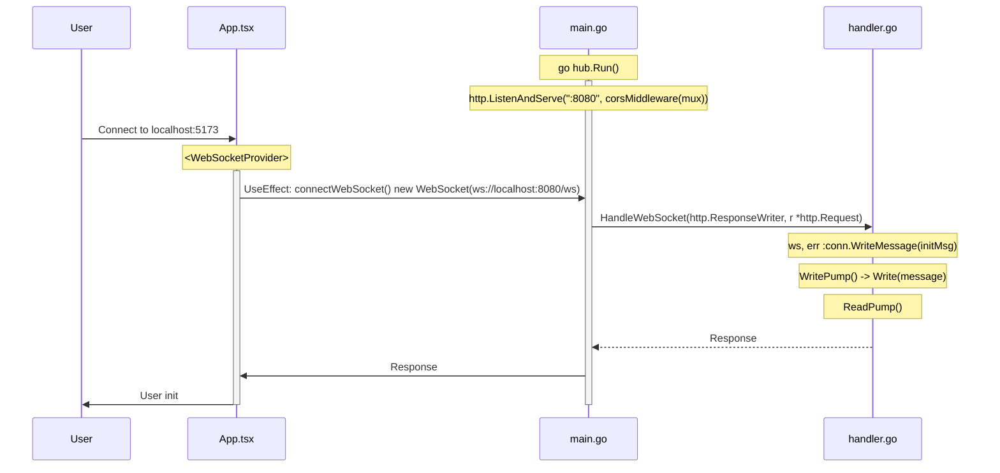

```mermaid
sequenceDiagram
    participant User
    participant App.tsx
    participant main.go
    Note over main.go: go hub.Run()
    activate main.go
    Note over main.go: http.ListenAndServe(":8080", corsMiddleware(mux))
    User->> App.tsx: Connect to localhost:5173
    Note over App.tsx: <WebSocketProvider>
    activate  App.tsx
    App.tsx->>main.go: UseEffect: connectWebSocket() new WebSocket(ws://localhost:8080/ws)
    main.go->>handler.go: HandleWebSocket(http.ResponseWriter, r *http.Request)
    Note over handler.go: ws, err :conn.WriteMessage(initMsg)
    Note over handler.go: WritePump() -> Write(message)
    Note over handler.go: ReadPump()
    handler.go-->>main.go: Response
    main.go->> App.tsx: Response
     App.tsx->>User: User init
    deactivate  App.tsx
    deactivate main.go
```