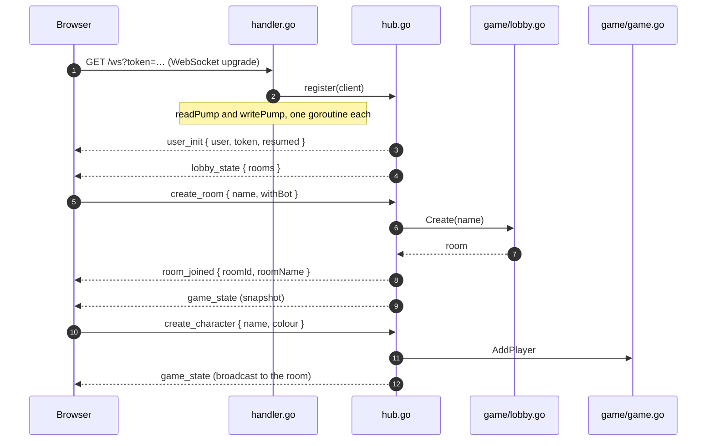
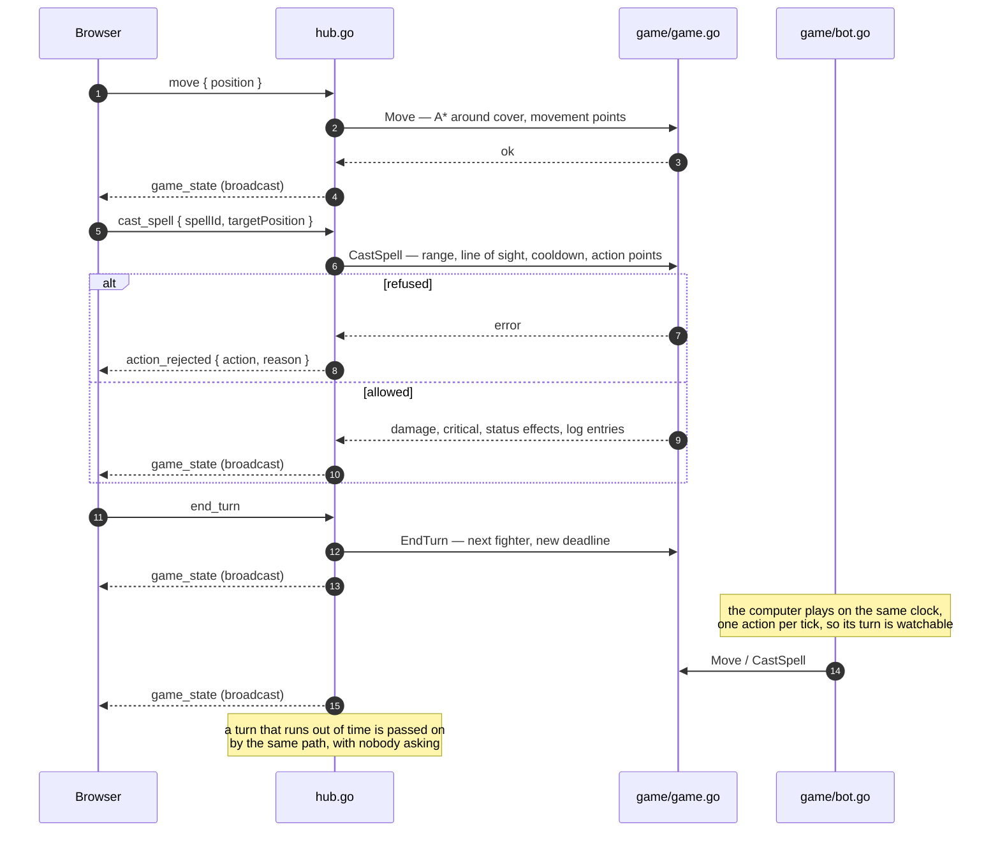

# How a match travels the wire

The server is the referee: the client asks, the server decides, and the answer
is always a whole `game_state` snapshot rather than a diff. These two diagrams
are the shape of that conversation.

## Connecting, and getting into a room

A connection is an identity. Inbound messages carry no user id at all, so a
client cannot act as another player; a resume token lets a reload come back as
the same character.

## A turn

Every rule — whose turn it is, whether a cell is in range, whether a spell is
affordable — is decided in Go. The client draws the snapshot it is given and
never decides anything; when it asks for something illegal it is told so.

